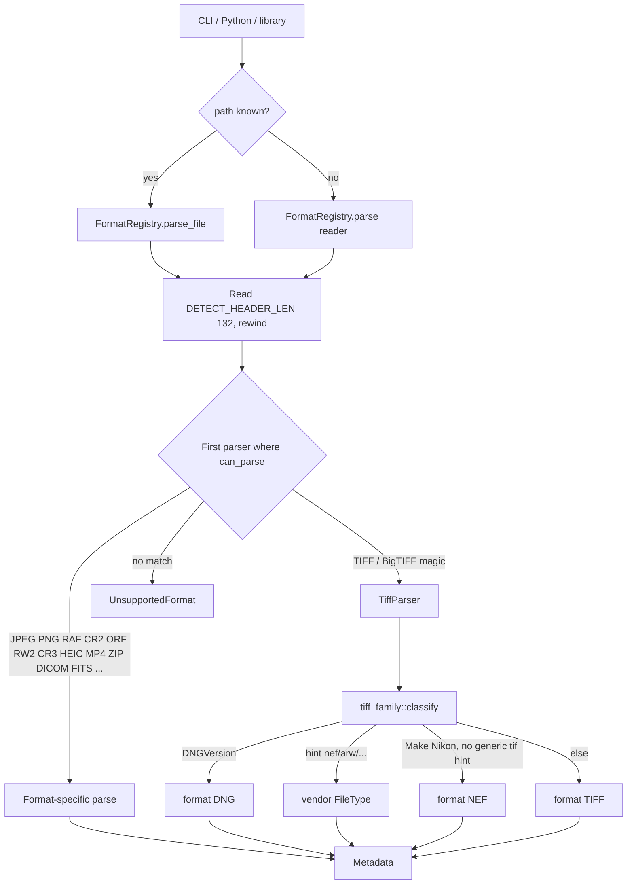
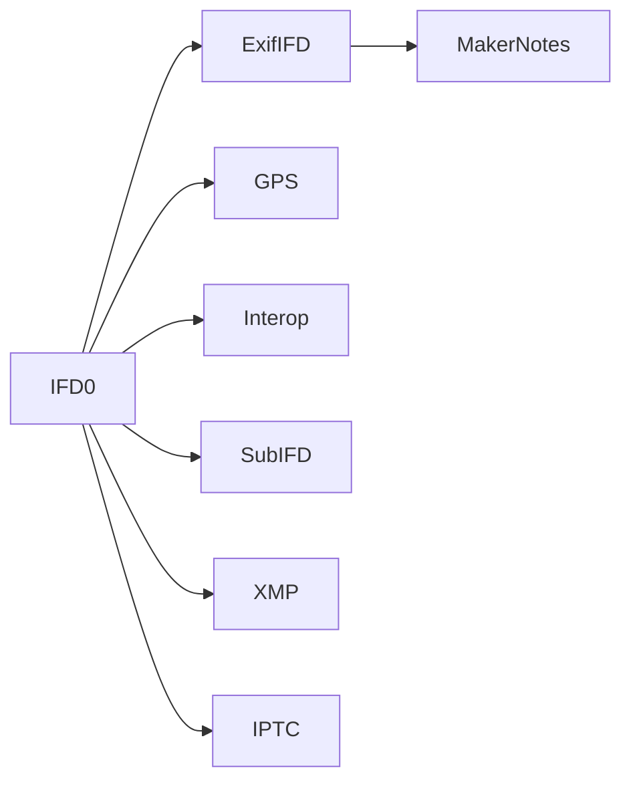

# DIAGRAMS.md — exiftool-rs formats

Reference: ExifTool 13.59 (`vfx.ref/exiftool`).

## Registry dispatch (as implemented)

TIFF-family wrappers (ERF, MEF, SRW, RWL, DCR, NEF, ARW, …) stay in `default_parsers()` for `by_extension` / `get`, but **`can_parse` is false** so they cannot steal TIFF magic.

## IFD walker

