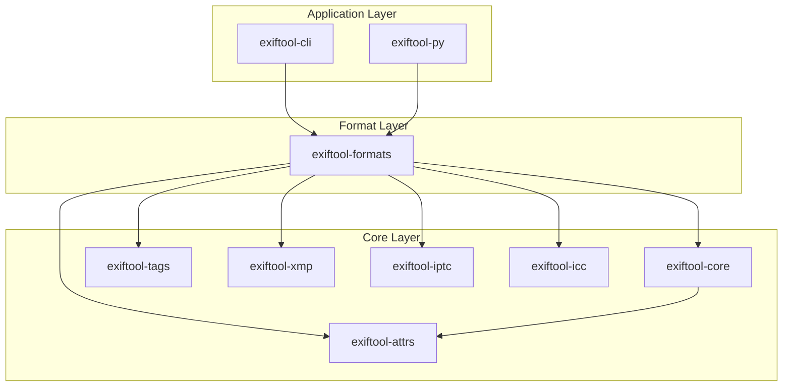
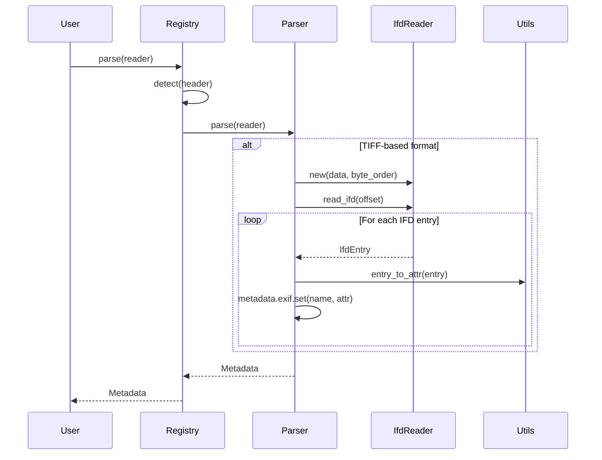
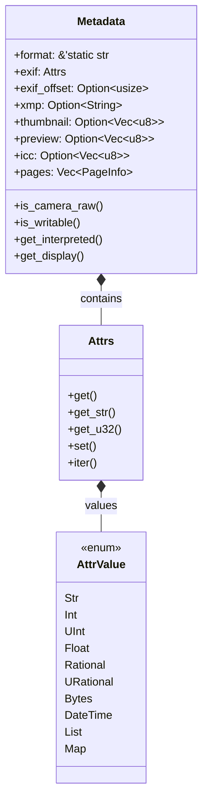
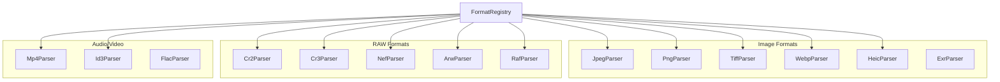
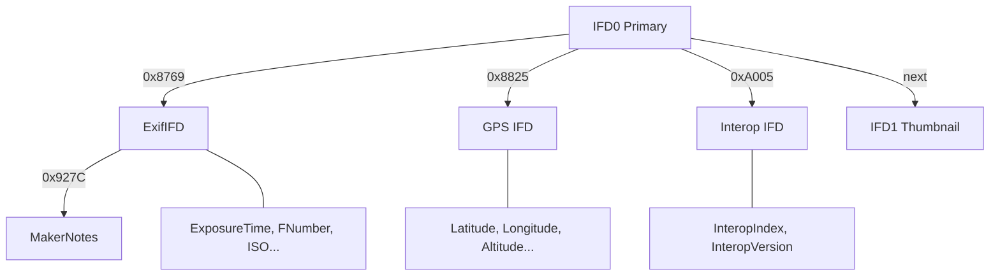
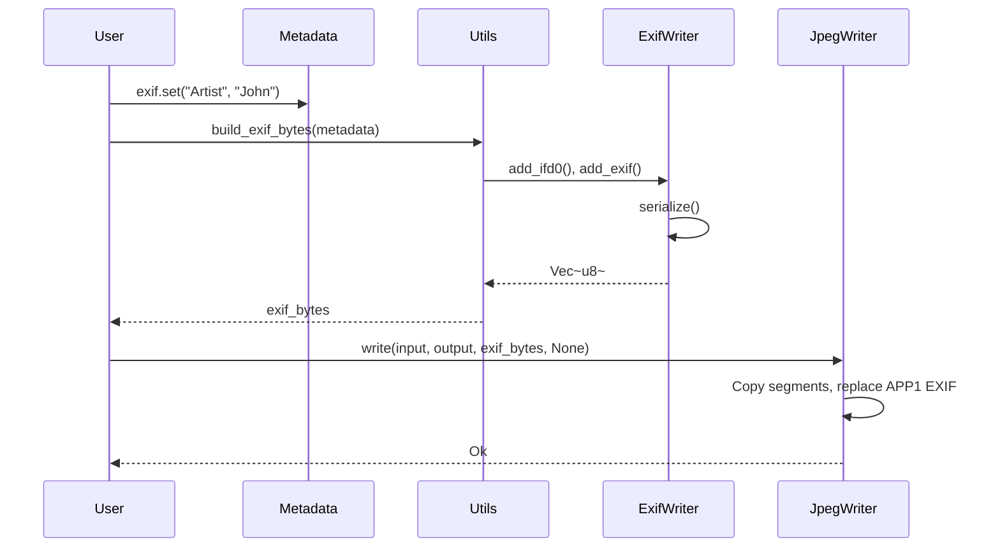
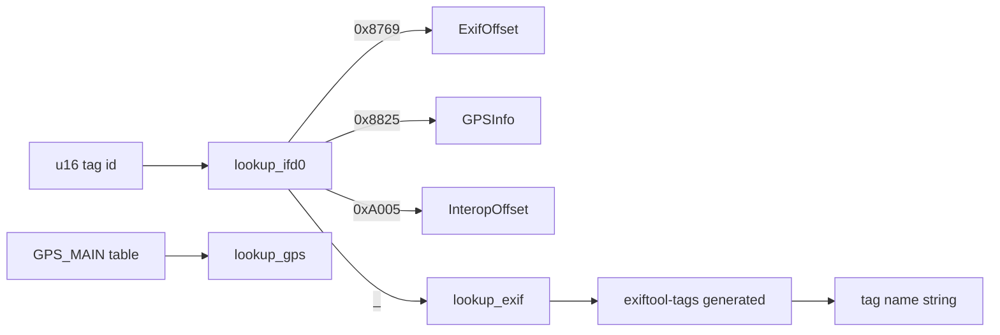

# exiftool-rs Diagrams (Mermaid)

## Crate Dependency Graph

## Parse Flow (Sequence)

## Metadata Structure

## Format Parser Hierarchy

## EXIF Sub-IFD Structure

## Write Path (JPEG Example)

## Tag Lookup Flow

