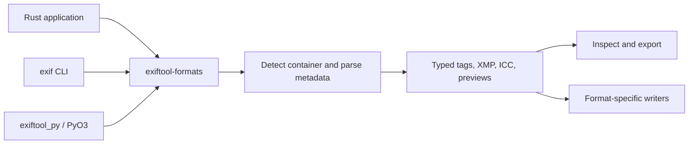

# exiftool-rs

[](https://github.com/ssoj13/exiftool-rs/actions/workflows/ci.yml)

**Read and edit metadata directly in Rust — with a Python API and the `exif` CLI.**

EXIF, XMP, IPTC, ICC profiles, camera MakerNotes, and container metadata across
images, camera RAW, audio, video, documents, and archives. No Perl interpreter or
ExifTool executable is needed at runtime.

> Experimental Rust port of a subset of [ExifTool](https://exiftool.org/).
> Format detection, tag coverage, and writing support vary by format. ExifTool
> remains the reference implementation; this project does not promise command-line
> compatibility or complete metadata preservation for every file.

[Get started](docs/src/getting-started/installation.md) ·
[Documentation](docs/index.md) ·
[Formats](docs/src/formats.md) ·
[Architecture](docs/src/architecture.md) ·
[Contributing](docs/src/contributing.md)

## Choose your interface

| Interface | Entry point | Guide |
|-----------|-------------|-------|
| Rust | `exiftool_formats::FormatRegistry` | [Read](docs/src/reading.md) / [write](docs/src/writing.md) |
| Python | `import exiftool_py` | [Installation](docs/src/python/installation.md) / [API](docs/src/python/api.md) |
| Command line | `exif` | [CLI guide](docs/src/cli.md) |



## Build and try the CLI

Use **Rust 1.96+**. The workspace fetches Git dependencies over SSH; you need
access to them before building. See [dependency access](docs/src/dependency-access.md)
for the complete list and CI configuration. Opening this repository alone does
not make its dependencies public.

```bash
git clone https://github.com/ssoj13/exiftool-rs.git
cd exiftool-rs
cargo install --path crates/exiftool-cli --locked

# Inspect a fixture included in the repository
exif crates/exiftool-formats/tests/testdata/Writer.jpg
exif -f json crates/exiftool-formats/tests/testdata/Writer.jpg

# Edit a copy
exif -w output.jpg -t Artist="Alex" crates/exiftool-formats/tests/testdata/Writer.jpg
```

Use `-p` explicitly for in-place edits. See the [CLI guide](docs/src/cli.md) for
batch filtering, time shifts, GPX geotagging, copying tags, and exports.

## Read metadata in Rust

Use the crates from a local checkout as described in [installation](docs/src/getting-started/installation.md).
This repository's CI and release workflows do not publish crates to crates.io.

```rust
use exiftool_formats::FormatRegistry;
use std::path::Path;

fn main() -> Result<(), Box<dyn std::error::Error>> {
    let registry = FormatRegistry::new();
    let metadata = registry.parse_file(Path::new(
        "crates/exiftool-formats/tests/testdata/Writer.jpg",
    ))?;

    println!("Format: {}", metadata.format);
    println!("Camera: {:?}", metadata.exif.get_str("Make"));
    for (name, value) in metadata.exif.iter() {
        println!("{name}: {value}");
    }
    Ok(())
}
```

`parse_file` supplies the extension hint used to classify TIFF-family RAW.
For bytes in memory, use `parse` with `std::io::Cursor`. See
[reading metadata](docs/src/reading.md) for typed accessors and previews.

## Use Python

Build the package from this checkout; the release workflow publishes CLI
archives rather than Python wheels. In an activated virtual environment:

```bash
python -m pip install maturin
maturin develop --release --manifest-path crates/exiftool-py/Cargo.toml
```

```python
import exiftool_py as exif

img = exif.open("crates/exiftool-formats/tests/testdata/Writer.jpg")
print(img.format, img.make, img.model)
if img.is_writable:
    img.artist = "Alex"
    img.save("output.jpg")
```

The distribution is named `exiftool-py`; the import is `exiftool_py`.
See [Python installation](docs/src/python/installation.md) for virtual environments,
wheel builds, and Python version requirements.

## Coverage and limits

- Reading spans images and RAW, audio/video containers, PDF, DICOM, FITS, and archives.
- Writing is format-specific: JPEG, PNG, TIFF/DNG, WebP, HEIC/AVIF, EXR, HDR,
  GIF, PNM, JXL, supported RAW, MP4/MOV-family containers, WAV, FLAC, and MP3.
- MakerNotes use generated vendor tables; recognizing a format does not mean
  every vendor field can be decoded or edited.
- Several parsers and writers buffer the input. The shared reader enforces a
  100 MiB limit; the library does not guarantee constant-memory streaming.
- Numeric values may need `get_interpreted` or `get_display` for readable output.

Use the [format reference](docs/src/formats.md), [writing guide](docs/src/writing.md),
and [performance guide](docs/src/performance.md) for details. Performance depends
on workload; no universal speedup over ExifTool is claimed.

## Develop and document

```bash
cargo test --workspace --exclude exiftool-py --locked
cargo check -p exiftool-py --locked
cargo doc --workspace --exclude exiftool-py --no-deps

# Build the documentation book with Mermaid diagrams
cargo install mdbook --locked
cargo install mdbook-mermaid --locked
mdbook build docs
```

[Building](docs/src/building.md) covers the bootstrap commands and code generation.
[CI/CD](docs/src/ci-cd.md) explains checks and runner updates.
[Releasing](docs/releasing.md) covers tagged CLI releases.

## License and attribution

Licensed under the [Perl Artistic License](LICENSE-ARTISTIC) **or** the
[GNU GPL, version 1 or later](LICENSE-GPL), matching ExifTool and Perl:
`Artistic-1.0-Perl OR GPL-1.0-or-later`. See [LICENSE](LICENSE).

Original work: ExifTool, Copyright © 2003–2026 Phil Harvey.
Rust port: Copyright © 2026 Alex Khalyavin. See [NOTICE.md](NOTICE.md).
