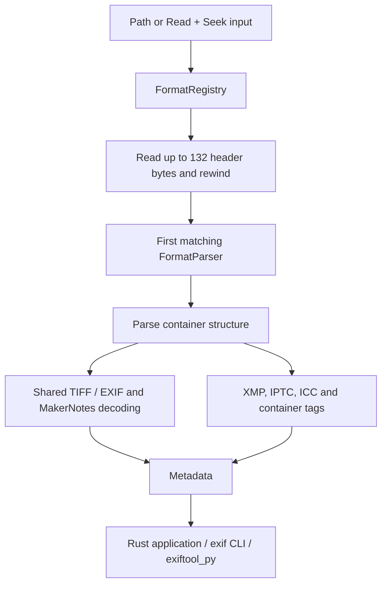
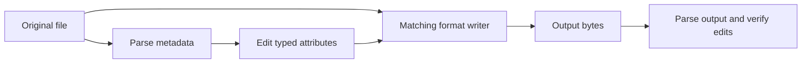

# Architecture

The workspace separates binary primitives, typed values, metadata standards,
container parsers, and user interfaces. Most applications enter through
`exiftool-formats`; the CLI and Python extension use the same library.

## From a file to metadata

`parse_file` additionally passes the filename extension. Generic TIFF parsing
classifies RAW from the extension, `DNGVersion`, and camera `Make` where needed.
See [parser design](architecture/parsers.md).

## Data model

`Metadata` holds the format name and an `Attrs` map named `exif`. That map can
include EXIF tags, IPTC fields, and container-specific attributes. Separate
fields hold raw XMP XML, ICC bytes, thumbnail and preview bytes, EXIF offset,
and TIFF pages/subfiles.

`Attrs` stores typed `AttrValue` values and supports typed accessors. Generated
tag tables provide names and conversions; `Metadata::get_interpreted` and
`get_display` format selected values for presentation.

## Reading and writing are separate paths

Detection selects a reader. Writers are called explicitly by format; there is
no registry method that saves every kind of `Metadata`.

Writers need the original container to retain image data and relevant structure.
TIFF-family RAW and CR3 use preservation-oriented rewrite paths rather than a
fresh minimal EXIF header. Field support and preservation behavior still vary;
see [writing metadata](writing.md).

## Boundaries and resource use

- Inputs implement `Read + Seek`; ordinary non-seekable network streams need buffering.
- Some parsers and writers read the entire file into memory. The shared reader
  limits inputs to 100 MiB. A seekable API is not a constant-memory guarantee.
- Tag tables are generated at development time from ExifTool sources. Runtime
  parsing does not invoke Perl; regeneration requires Perl and an ExifTool source tree.
- The Python extension uses PyO3; this is not a blanket claim about `unsafe`
  code or dependencies across the workspace.

See [crate structure](architecture/crates.md), [performance](performance.md),
and [building](building.md).
