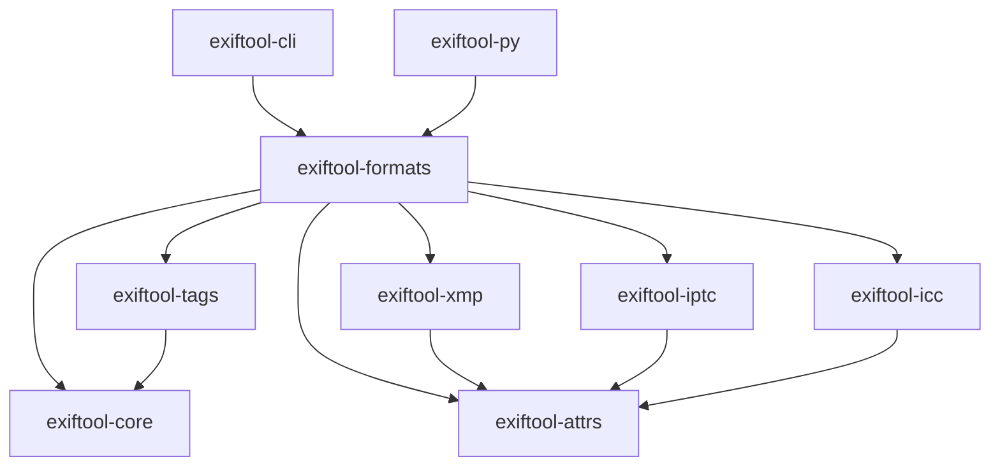

# Crate structure

Arrows show internal dependency direction. The graph summarizes the shared
library layers; the CLI and Python extension also depend directly on some of
these layers for editing and presentation.

## Workspace members

| Crate | Responsibility | Main entry points |
|-------|----------------|-------------------|
| `exiftool-formats` | Container detection, parsers, writers, MakerNotes | `FormatRegistry`, `FormatParser`, `Metadata`, `JpegWriter` and other writers |
| `exiftool-core` | Byte order, TIFF/IFD structures and raw values | `ByteOrder`, `IfdReader`, `ExifWriter`, `WriteEntry` |
| `exiftool-attrs` | Typed attribute storage, schema and dirty tracking | `Attrs`, `AttrValue` |
| `exiftool-tags` | Generated tag definitions and interpretation | `generated`, `interp` |
| `exiftool-xmp` | XMP XML parsing, writing and sidecars | `XmpParser`, `XmpWriter` |
| `exiftool-iptc` | IPTC-IIM parsing and serialization | `IptcParser`, `IptcWriter` |
| `exiftool-icc` | ICC profiles and tag interpretation | Profile parsing APIs |
| `exiftool-cli` | Filtering, export, editing and file operations | `exif` executable |
| `exiftool-py` | Python object model and parallel scans through PyO3 | `exiftool_py.Image`, `open`, `scan`, `scan_dir` |
| `xtask` | Tag extraction, code generation and parity tooling | `cargo xtask` commands |

`exiftool-core` does not depend on `exiftool-attrs`; the conversion between raw
IFD entries and typed attributes happens in the formats layer.

## External Git dependencies

`exiftool-formats` depends on `exr-core`, `jpg-rs`, and `jph-rs`. Their transitive
Git dependencies are part of source builds too. See
[dependency access](../dependency-access.md) for repositories and credentials.

## Choose a layer

Use `exiftool-formats` for normal file operations. Use `exiftool-attrs` when
constructing or editing values. Choose `exiftool-core` for direct TIFF/IFD work,
or a metadata-standard crate when you already have an extracted XMP, IPTC,
or ICC payload.

See [architecture](../architecture.md) and [parser design](parsers.md).
