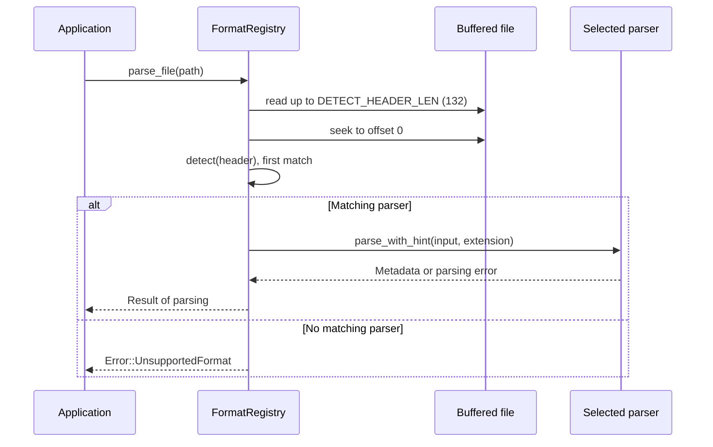

# Parser design

Every container parser implements `FormatParser: Send + Sync`. The trait exposes
`can_parse`, `format_name`, `extensions`, `parse`, and `parse_with_hint`.
`ReadSeek` is the object-safe wrapper for `Read + Seek`.

## Detection and dispatch

`default_parsers()` in `crates/exiftool-formats/src/parsers.rs` is the central
registration list. `FormatRegistry` selects the first parser whose `can_parse`
accepts the header. Order is part of detection behavior.



The 132-byte header allows DICOM detection after its 128-byte preamble.
`detect(header)` only examines the bytes supplied by the caller.

## TIFF-family classification

CR2, ORF, and RW2 have distinctive header signatures and dedicated detection
before generic TIFF. Other TIFF-family RAW wrappers are available through
`get` and `by_extension`, while automatic detection uses `TiffParser` followed
by TIFF-family classification. `parse_file` supplies the filename extension;
`parse` on anonymous bytes cannot supply that hint, though metadata such as
`Make` and `DNGVersion` can help classify the result.

Extensions therefore help classify a valid container rather than bypassing
magic-byte detection.

## A custom registry

A custom parser list changes detection and dispatch. It does not remove
Cargo dependencies or provide feature-based minimal builds.

```rust
use exiftool_formats::{FormatParser, FormatRegistry, JpegParser, PngParser};

let parsers: Vec<Box<dyn FormatParser>> = vec![
    Box::new(JpegParser),
    Box::new(PngParser),
];
let registry = FormatRegistry::with_parsers(parsers);
assert!(registry.detect(&[0xff, 0xd8, 0xff]).is_some());
```

## Shared metadata parsing

Containers with TIFF-formatted EXIF use `utils::parse_tiff_exif`.
`entry_to_attr` converts raw IFD values into `AttrValue`.
Tag lookup and MakerNotes decoding use the generated tables and vendor modules.
Container-specific parsers retain their own structural rules and error handling.

Malformed files can produce `InvalidStructure`, `MissingSegment`, `Io`,
`FileTooLarge`, or nested metadata-standard errors. Some parsers recover partial
data, but callers should handle an error rather than assume every parser always
returns a partial result.

For adding a parser, see [contributing](../contributing.md).
