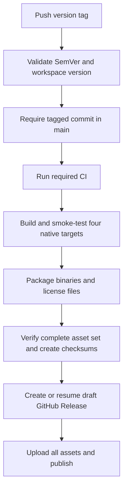

# CI and release automation

The repository has two workflows: `ci.yml` checks source changes and
`release.yml` publishes CLI archives for version tags. Both use the shared
[dependency-fetch action](dependency-access.md).

## Toolchain and runner policy

| Component | Configuration |
|-----------|---------------|
| Linux | `ubuntu-26.04` |
| Windows | `windows-2025-vs2026` |
| macOS | `macos-26` (arm64), `macos-26-intel` (Intel release build) |
| Rust | Latest `stable` for normal checks and builds |
| Minimum supported Rust | Separate `1.96.0` check matching the workspace requirement |
| Python | Latest stable `3.x`, with `check-latest: true` |
| GitHub Actions | Released versions pinned to full commit SHAs |
| Action updates | Daily Dependabot checks |

Use explicit current OS labels: `ubuntu-latest` can lag the newest available
image during a migration. Review [runner availability](https://github.com/actions/runner-images)
and native build behavior when updating labels.

Actions pinned here are checkout v7.0.1, setup-python v7.0.0, upload-artifact
v7.0.1, and download-artifact v8.0.1. The Rust toolchain action is pinned to its
stable action revision, while its `toolchain: stable` selects current Rust.
SHA pinning controls the action implementation; it does not pin the hosted OS
image or the stable toolchain patch version.

## Source checks

CI runs on pushes to `main`, pull requests, manual dispatch, and calls from the
release workflow. Its native test matrix covers Linux, Windows, and macOS.
After fetching locked dependencies, Cargo commands run locked and offline.

Required test jobs run Rust tests (excluding the Python extension), check all
non-Python targets, check the Python extension, build and smoke-test `exif`, and
test the release scripts. A separate job checks Rust 1.96.0.

A separate documentation job installs current `mdbook` and `mdbook-mermaid`
and builds the book. It does not need private Git dependency access.

The quality job runs formatting, strict Clippy, and Rustdoc. Those steps are
currently **advisory** (`continue-on-error: true`), so a green workflow does not
prove that all quality findings are resolved. Inspect its summary before
making it a branch-protection requirement.

## Tagged releases



Release targets are GNU/Linux x86_64, Windows MSVC x86_64, macOS Intel, and
macOS arm64. No crates.io or PyPI publication is configured. The publish job
gets `contents: write`; other jobs use read permissions.

The GNU/Linux binary is built on Ubuntu 26.04. Its system-library requirements
can reflect that environment; compatibility with older distributions is not
promised by this pipeline. Supporting an older glibc baseline needs a separate
build strategy and runtime verification.

See [releasing the CLI](../releasing.md) for tag commands and recovery behavior.

## Check a run

```bash
gh run list --repo ssoj13/exiftool-rs --limit 5
gh run view --repo ssoj13/exiftool-rs
```

Select a run and inspect each job. A successful run proves only the checked
commit and runner configuration; local workflow edits need a new hosted run.
Dependency authentication failures should be resolved using
[dependency access](dependency-access.md).
